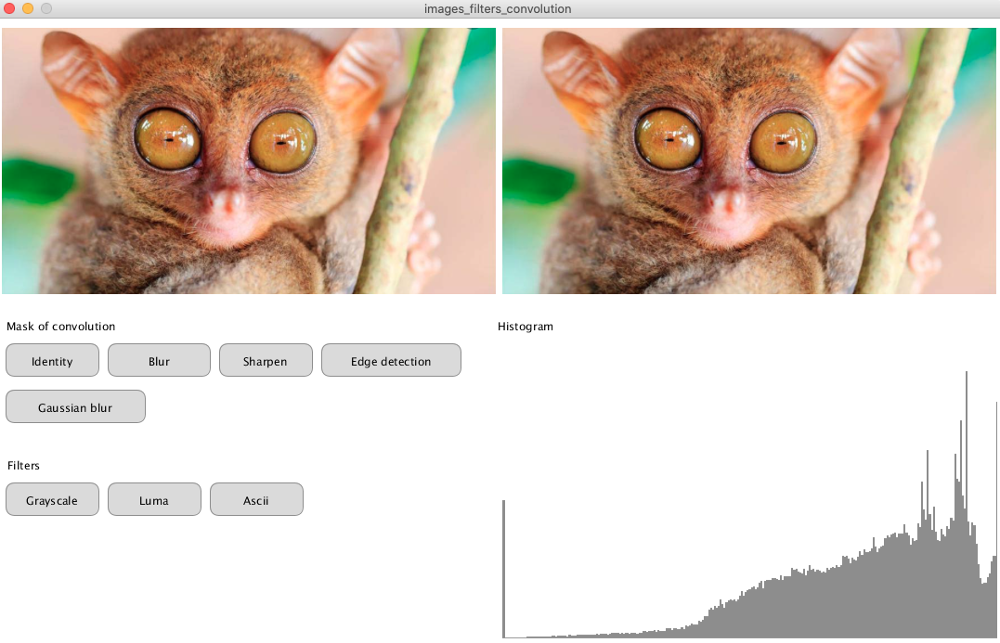
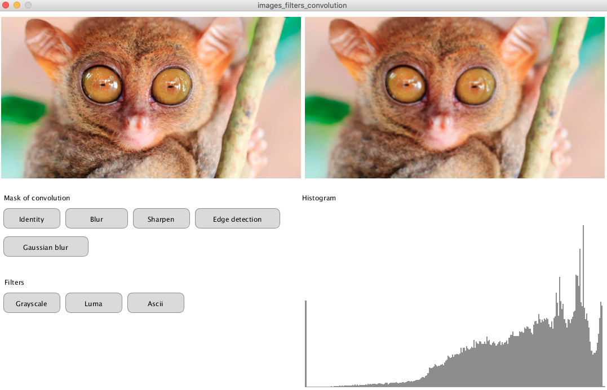
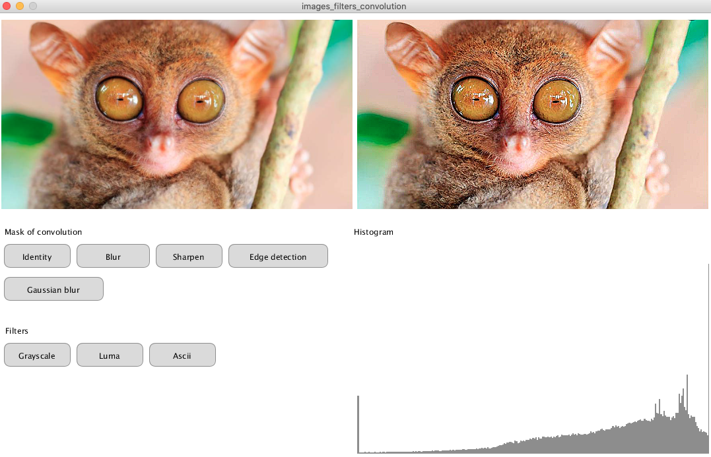
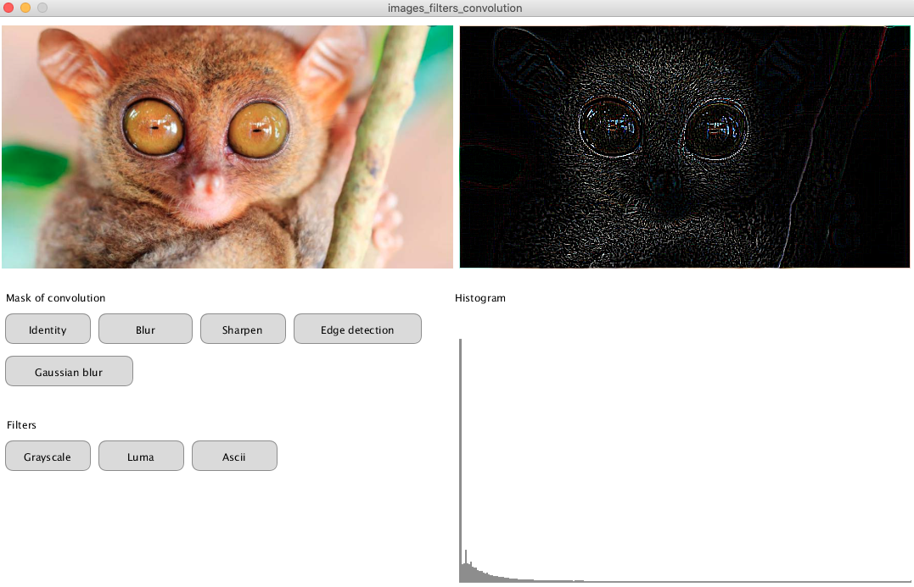
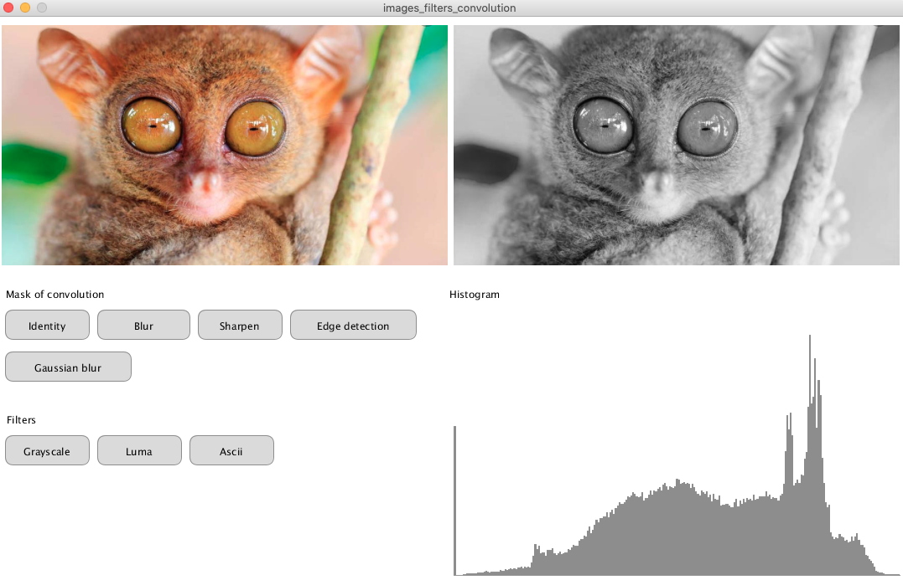
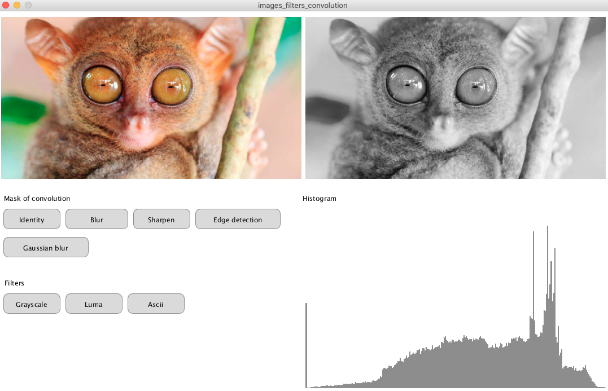
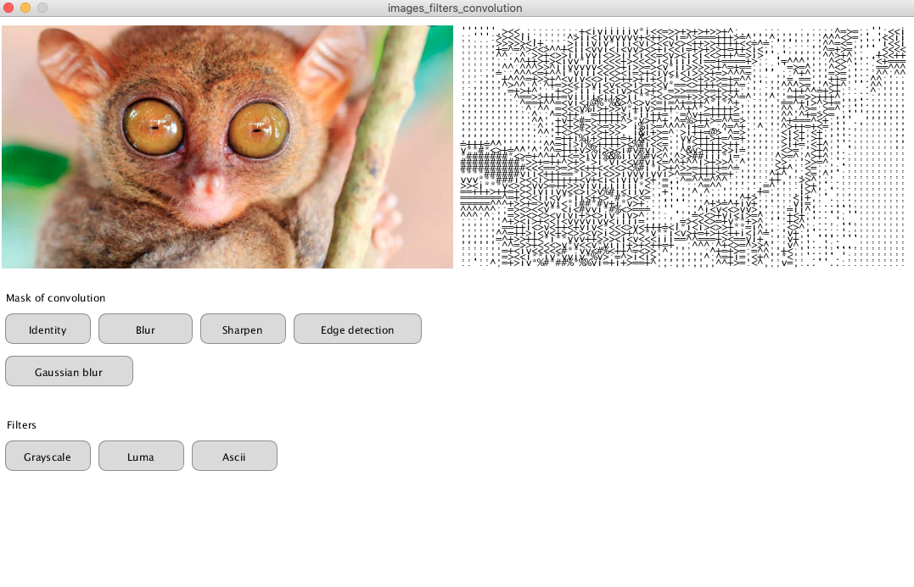

# Computación visual

## Taller 1

Taller de análisis de imágenes/video al implementar diferentes operaciones tanto por software como por hardware(shaders).

### Integrantes

* Juan Sebastian Narvaez
* Diego Felipe Rodriguez

### Motivación

Hoy en día, el procesamiento de imágenes se encuentra entre las tecnologías de rápido crecimiento, pues varias compañías de tecnología, están apostándole a mejorar las fotografías que realizan sus dispositivos con distintas técnicas de procesamiento de imagen para lograr resultados como zoom digital, modo nocturno, modo retrato, calibración HDR, reducción de ruido, entre muchas otros.

### Objetivo

* Aplicar diferentes filtros y mascaras de convolución a imagenes y videos tanto por software como por hardware

### 1 Analisis por software

#### 1.1 Imagenes

##### 1.1.1 Metodología y resultados

###### 1.1.1.1 Mascaras de convolución

Para aplicar mascaras de convolución a la imagen, se recorre pixel por pixel y para cada uno de ellos, se multiplica su valor y el valor de los 8 pixeles adyacentes(para matrices 3x3) por la matriz de covolución del filtro deseado, asi:


Para calcular estas operaciones tenemos el siguiente código, que realiza las operaciones descritas para los valores rgb de cada pixel calculado y al final lo consolida en un solo valor de tipo *color* y lo reasigna al respectivo pixel.

```java
  for (int y = 1; y < pg.height-1; y++) {   // Skip top and bottom edges
    for (int x = 1; x < pg.width-1; x++) {  // Skip left and right edges
      float rtotal=0 ;
      float gtotal=0; 
      float btotal=0;
      // Kernel sum for this pixel
      for (int ky = -1; ky <= 1; ky++) {
        for (int kx = -1; kx <= 1; kx++) {
          // Calculate the adjacent pixel for this kernel point
          int pos = (y + ky)*original_video.width + (x + kx);
          // Multiply adjacent pixels based on the kernel values
          rtotal += red(original_video.pixels[pos]) * matrix[ky+1][kx+1];
          gtotal += green(original_video.pixels[pos]) * matrix[ky+1][kx+1];
          btotal += blue(original_video.pixels[pos]) * matrix[ky+1][kx+1];
        }
      }
      color c = color(rtotal,gtotal,btotal);
      int i = x + y*original_video.width;
      pg.pixels[i] = c;
    }
  }
```

De esta manera, obtenemos los siguientes resultados para diferentes filtros. Se tiene un histograma para medir los niveles de brillo de la imagen filtrada.

###### 1.1.1.1.1 Identidad 

Para este filtro se utiliza la matriz de convolución: 

| 0 | 0 | 0 |
|---|---|---|
| 0 | 1 | 0 |
| 0 | 0 | 0 |

La cual no modifica ningun valor en los pixeles de la imagen, y así obtenemos el mismo resultado de la imagen original



###### 1.1.1.1.2 Blur

Con el filtro blur se obtiene un efecto de difuminado sobre la imagen y utiliza la siguiente matriz de convolución:

| 0.11 | 0.11 | 0.11 |
|---|---|---|
| 0.11 | 0.11 | 0.11 |
| 0.11 | 0.11 | 0.11 |



###### 1.1.1.1.3 Sharpen

El filtro Sharpen acentúa los bordes pero también cualquier ruido o mancha y utiliza la siguiente matriz de convolución:

| 0 | -1 | 0 |
|---|---|---|
| -1 | 5 | -1 |
| 0 | -1 | 0|



###### 1.1.1.1.3 Edge detection

La detección de bordes identifica puntos en los que el brillo de la imagen cambia bruscamente. Para este filtro se utilizó la siguiente matriz de convolución:

| -1 | -1 | -1 |
|---|---|---|
| -1 | 8 | -1 |
| -1 | -1 | -1|



###### 1.1.1.2 Escala de grises y Luma

Para realizar el filtro de escala de grises y luma, se recorre cada pixel de la imagen, se calculan sus valores rgb y se hacen operaciones sobre estos así:

**Escala de grises**: Se promedian los valores rgb de cada pixel. `(r+g+b)/3`

**Luma**: Se recalculan los valores rgb para el pixel multiplicando asi: `(0.2989 * r) + (0.5870 *g) + (0.1140 * b)` y se actualizan los valores.

El código que utilizamos para realizar estas operaciones es el siguiente:

```java
for (int i = 0; i < pg.pixels.length; i++) {
    float red = red(pg.pixels[i]);    
    float green = green(pg.pixels[i]);
    float blue = blue(pg.pixels[i]);
    if(filter=="grayscale"){
      pg.pixels[i] = color(int((red+green+blue)/3));
    }
    if(filter=="luma"){
      pg.pixels[i] = color((0.2989 * red) + (0.5870 *green) + (0.1140 * blue));
    }
  }
```
Y así obtenemos los siguientes resultados: 

**ESCALA DE GRISES**



**LUMA**



###### 1.1.1.3 Ascii

Para lograr representar una imagen por ascci, es necesario recorrer todos sus pixeles, y para cada uno se le asigna un caracter ascii dependiendo del promedio de brillantez que tenga. 

Este es el código que utilizamos para calcular y mostrar la imagen en ascii

```java
  pg.beginDraw();
  pg.image(copy_img,0,0);
  pg.loadPixels();
  textSize(6); 
  ascii = new char[256];
  String letters = "@&%#*vi<>+=^;,:'. ";
  for (int i = 0; i < 256; i++) {
    int index = int(map(i, 0, 256, 0, letters.length()));
    ascii[i] = letters.charAt(index);
  }
  for (int y = 5; y <original_img.height-5; y += 4) {
    for (int x = 5; x < original_img.width-5; x += 4) {
      int index = (x + y * pg.width);
      float r = red(pg.pixels[index + 0]);
      float g = green(pg.pixels[index + 1]);
      float b = blue(pg.pixels[index + 2]);
      float brig = (r+g+b)/3;
      text(ascii[int(brig)], x+545, y+10);
    }
  }
  pg.updatePixels();
  pg.endDraw();
```

Y obtuvimos el siguiente resultado




#### 1.2 Video

##### 1.2.1 Metodología y resultados

###### 1.2.1.1 Mascaras de convolución

Se utiliza el mismo metodo que en las mascaras de convolución en imagenes y se obtienen los siguientes resultados.

###### 1.2.1.1.1 Blur


###### 1.2.1.1.2 Sharpen


###### 1.2.1.1.3 Edge detection


###### 1.2.1.1.4 Gaussian blur


###### 1.2.2.2 Escala de grises y Luma

###### 1.2.2.2.1 Escala de grises 


###### 1.2.2.2.2 Luma


###### 1.1.2.3 Ascii


### 2 Analisis por hardware
El objetivo del analisis por hardware es obtener los mismos resultados expuestos en el apartado 1 de este informe a traves del uso de shaders.

#### 2.1 Metodología y resultados
Para el desarrollo de estos ejercicios de shaders solo fue necesario crear fragment shaders y pasar las variables a traves de la función `set(name, value)` del objeto PShader, las cuales el shader interpretaba como variables uniformes.

Para la correcta interpretación de la imagenes por parte del shader, fue necesario crear un objeto PShape,  establecer la imagen como la textura del objeto y definir su geometria teniendo en cuenta las dimensiones de la imagen y su ubicación en la ventana.

###### 2.1.1 Escala de grises y luma
Para realizar este ejercicio se crearon dos fragment shaders: *gray-mean-frag.glsl* y *luma-frag.glsl*, la diferencia entre los dos radica en el calculo de los niveles de grises. En el caso de *gray-mean-frag.glsl* fue:

```glsl
float gray = (color.r + color.g + color.b) / 3.0;
```

Para *luma-frag.glsl* se calculó a partir de la función dada por luma 601:

```glsl
#define LUMA_VALUES vec3(0.2989, 0.5870, 0.1140)
float lum = dot(color.rgb, LUMA_VALUES);
```
Y al final se define el color del pixel actual como el resultado de la operación realizada anteriormente:
```glsl
gl_FragColor = vec4(vec3(GRAY_CALCULATION_RESULT), color.a);
```
Se deja el valor del alpha igual al del color original para mantener el efecto de transparencia que algunas imagenes puedan tener, lo cual no se mantiene si se define como 1.

###### 2.1.2 Mascaras de convolución
Para este ejercicio se implemento el fragment shader *conv-frag.glsl* que recibe como parametros:
* Un arreglo `float[9]` que contiene los valores de la mascara de convolución 3x3 *.
* Un vector de tamaño 2 (`vec2`) que contiene las dimensiones `(width, height)` de la imagen a usar.

***nota:** Este fragment shader solo funciona con mascaras de convolución de tamaño de 3x3, que son las más comunes de usar.

La estrategia usada es: 
1. Calcular el valor del paso en *x* y *y* con ayuda de las dimensiones de la imagen.
```glsl
uniform vec2 renderSize;            // (width,height)
vec2 stepSize = 1.0/(renderSize);
```
2. Obtener los valores de color de los pixeles vecinos con el paso obtenido anteriormente. 
3. Multiplicar cada uno de esos valores con su valor correspondiente en la mascara de convolución. 
4. Sumar los valores obtenidos en el paso 2 y establecer ese resultado como el valor del color actual.  
```glsl
vec4 sum = vec4(0.0);

sum += mask[0] * texture2D(texture, vec2(coords.x - stepSize.x, coords.y - stepSize.y));
sum += mask[1] * texture2D(texture, vec2(coords.x, coords.y - stepSize.y));
...
sum += mask[8] * texture2D(texture, vec2(coords.x + stepSize.x, coords.y + stepSize.y));
sum.a = originalColor.a; 
gl_FragColor = sum;
``` 
Se mantiene el valor de alpha del color original.

###### 2.1.3 ASCII
Para este ejercicio se escribio el fragment shader *ascii-frag.glsl* que recibe como parametros:

* Un objeto PShape que tiene como textura la imagen con los caracteres ASCII a ser usados ordenados por su nivel de brillantez que tiene (empezando por el más claro hasta llegar al más oscuro).
* Un arreglo `float[4]` que contiene los siguientes parametros numericos en el orden mostrado:

    * Número de caracteres ASCII en el eje X de la imagen (Número de columnas).
    * Número de pixeles que ocupa cada caracter ASCII en el eje X y Y (Caracteres de n x n).
    * Número de caracteres ASCII en el eje Y de la imagen (Número de filas).
    * Número de caracteres ASCII disponibles (Niveles de brillantez).

La estrategia usada es:

1. Se define un número de columnas en las que se divide la imagen y en base a este número se genera la imagen que tiene los caracteres ASCII a usar con las dimensiones indicadas.
```cpp
/* En third.pde */
PGraphics createChars(String[] s) {
  float fontWidth = floor(imgWidth)/colNumber;      // Se crean caracteres de n x n 
  float fontHeight = fontWidth;
  PGraphics pg = createGraphics(int(fontWidth * s.length), int(fontHeight), P2D);
  pg.beginDraw();
  pg.background(255);
  pg.textSize((fontWidth+fontHeight)/2);
  pg.textAlign(CENTER);
  pg.fill(0);  
  for(int i = 0; i < s.length; i++) {    
    pg.text(s[i], (fontWidth * i) + fontWidth / 2 , fontHeight - 2);
  }
  pg.endDraw();
  return pg;
}
```
2. Se pasa esta textura y el arreglo con los otros parametros al shader.
3. Ya en el shader, procedemos a pixelar la imagen en base al número de columnas definidas para la imagen, dejando pixeles de tamaño n x n (mismo tamaño de los caracteres creados en el paso 1).
```glsl
float x = float(int(vertTexCoord.x * tilesX))/tilesX;
float y = float(int(vertTexCoord.y * tilesY))/tilesY;  
vec2 coord = vec2( x, y );
vec4 pixel = texture2D(texture, coord);
```
4. Se calcula el nivel de brillantez del cuadro actual.
```glsl
#define GRAY_VALUES vec3(0.299, 0.587, 0.114)
float gray = dot(pixel.rgb, GRAY_VALUES);
```
5. Calculamos las coordenadas del pixel actual sobre la textura con los caracteres ASCII.
```glsl
float char_x = mod(coord.x, tilesX) * tileW;
float char_y = -mod(coord.y, tilesY) * tileH;
``` 
6. Obtenemos el offset en X para ubicarlo sobre el caracter que se necesita
```glsl
float eq_x = float(tileW/int(tileW * numChars));  
vec2 charCoords = vec2( int(gray * eq_x) + int(char_x * eq_x), char_y );  
```
7. Al final establecemos el color actual como el color obtenido sobre la textura de los caracteres con las coordenadas transformadas.
```glsl
gl_FragColor = texture2D(characters, charCoords);
```

**Nota:** Esta implementación finalmente no produjo los resultados esperados debido a una particularidad que se encontro sobre las operaciones realizadas en el shader.

Dependiendo de la forma en que se agrupen las expresiones y se les haga un *casting*, la operación arroja o no arroja resultado. En caso de no arrojar, el programa no termina abruptamente y no muestra ningún error.

El ejemplo más claro se puede encontrar en el paso 5, en esta expresión:

```glsl
float x = float(int(vertTexCoord.x * tilesX))/tilesX;
```
A pesar de ser una operación sencilla, si no es escrita de esta forma exacta, con los diferentes *casting* mostrados, no arroja resultado y no pixela la imagen como se espera. Se sospecha que debido a esto, ciertas operaciones no arrojan los resultados esperados y por ende, no se obtiene el valor deseado.

### Conclusiones


* A raiz de la realización de este taller, durante el trabajo con shaders, es una buena práctica descomponer las operaciones en expresiones más sencillas para poder corregir los errores de una forma más localizada.


